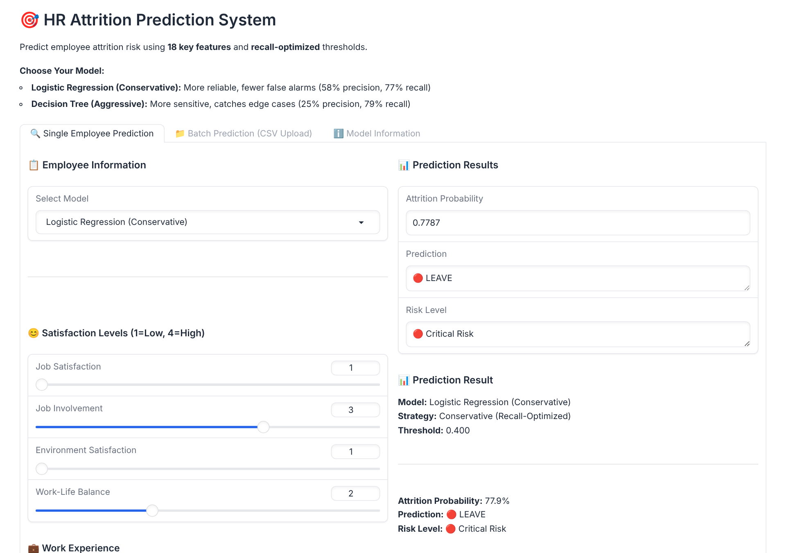
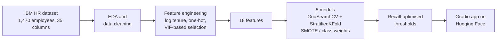

# HR Attrition Prediction

[](https://github.com/filipe-carmo/EDSB25_10/actions/workflows/tests.yml)
[](https://huggingface.co/spaces/filipe-carmo/hr-attrition-prediction)


**Predicting which employees are likely to leave, so HR can act before they do.** An end-to-end machine learning project: business framing, EDA, feature engineering, five models with recall-optimised decision thresholds, and a Gradio app deployed to Hugging Face through GitHub Actions.

**▶ Try it: [huggingface.co/spaces/filipe-carmo/hr-attrition-prediction](https://huggingface.co/spaces/filipe-carmo/hr-attrition-prediction)**



## The problem

A consultancy loses about 16% of its people, and every departure costs hiring and ramp-up time. HR wants to know **who is at risk and why**, early enough to intervene. Missing a leaver costs more than an unnecessary check-in, so the models are tuned for **recall**: instead of the default 0.5, each model's decision threshold was chosen on the validation set to catch at least 70% of leavers.

## Results

Held-out test set: 294 employees, 47 of whom left.

| Model | ROC AUC | Recall | Precision | Missed leavers | False alarms |
|---|---:|---:|---:|---:|---:|
| **Logistic Regression** (deployed, "conservative") | **0.81** | 0.77 | **0.34** | 11 | **70** |
| Decision Tree (deployed, "aggressive") | 0.72 | **0.79** | 0.25 | **10** | 111 |
| Random Forest | 0.76 | 0.72 | 0.30 | 13 | 78 |
| Neural Network (MLP) | 0.73 | 0.70 | 0.32 | 14 | 70 |
| XGBoost | 0.72 | 0.66 | 0.23 | 16 | 103 |

Logistic Regression gives the best balance: it catches 36 of 47 leavers with the fewest false alarms and the best ranking quality. The Decision Tree catches one more leaver at the cost of 41 more false alarms, which suits a proactive retention programme. The app lets HR choose between the two. Source: [`models/model_comparison_recall_optimized.csv`](models/model_comparison_recall_optimized.csv).

**Strongest attrition signals** (Logistic Regression coefficients): working overtime, being single, frequent business travel, the Laboratory Technician role and having worked at many companies push risk up; a longer career, higher job and environment satisfaction and working in R&D pull it down.

## Approach



- **Data:** the IBM HR Analytics Employee Attrition dataset (`data/raw/`), split 60/20/20 with stratification.
- **Features:** log-transformed tenure (`TotalWorkingYears`, `YearsAtCompany`), scaled satisfaction scores, one-hot encoded role/department/travel/marital status/overtime. Multicollinear features were removed with VIF analysis, leaving 18.
- **Models:** Logistic Regression, Decision Tree, Random Forest, XGBoost and an MLP. Each was tuned with cross-validated grid search, with class imbalance handled by SMOTE or class weights.
- **Thresholds:** each model keeps a default, an F1-optimised and a recall-optimised threshold in its metadata JSON; the app uses the recall-optimised one.
- **Deployment:** `preprocessing.py` is shared by the notebooks (`preprocess`) and the app (`transform_new_data`), and a test checks that both produce identical features. Pushing app or model changes to `main` syncs them to the Hugging Face Space ([workflow](.github/workflows/sync-to-hf.yml)).

## Run it locally

```bash
git clone https://github.com/filipe-carmo/EDSB25_10.git
cd EDSB25_10
python -m venv .venv && source .venv/bin/activate

pip install -r requirements.txt   # app only (pinned to match the saved models)
python app.py                     # http://127.0.0.1:7860

pip install pytest && pytest -q tests
```

To re-run the analysis, install `requirements-dev.txt` and run the notebooks in order (1 to 9).

## Repository

```text
app.py               Gradio app: single and batch (CSV) predictions
preprocessing.py     Shared training/inference preprocessing
notebooks/           1 business problem → 2 EDA → 3 features → 4-8 models → 9 evaluation
models/              Trained models, scaler/imputer, metadata and comparison tables
data/                Raw dataset and processed train/val/test splits
tests/               Pipeline consistency, model performance and app tests
reports/             Final presentation (PowerPoint)
project_brief/       Original brief and data dictionary
```

## Team

Group capstone project (EDSB25, group 10) by **Filipe Brandão Carmo**, João Silva, Rita Marques and Sara Henriques.

My part: I built and deployed the Gradio app and the GitHub Actions → Hugging Face pipeline, set up the repository structure and shared preprocessing module, revised the modelling notebooks, and put together the final report.
